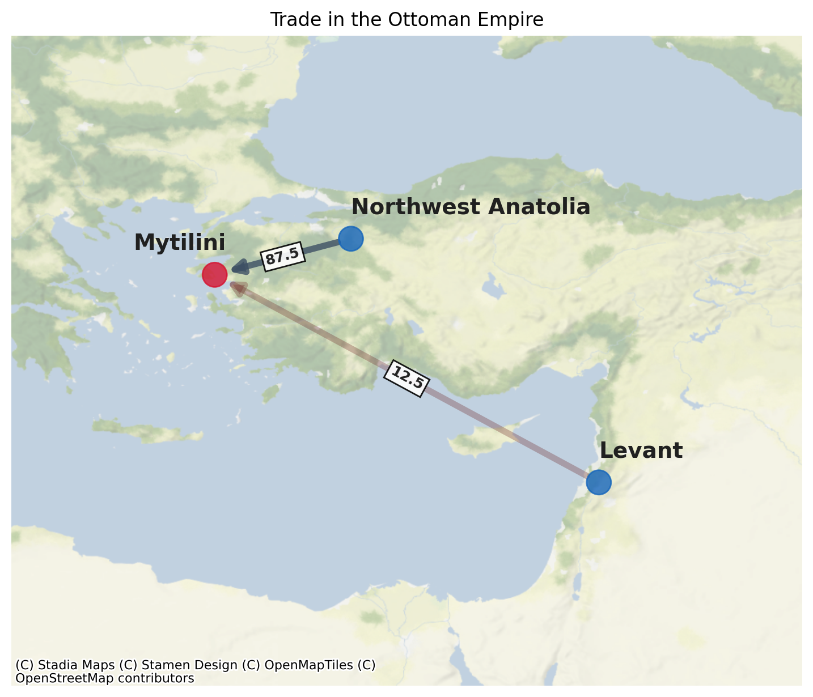

# Analyze historical trades using Graph theory

TODO: Consult Tsveta for better summary

## Dataset

* `coordinates.csv` contains the latitude and longitude coordinates of archeological sites
* `imports_detailed.csv` contains the following information for trade route specified by a `source` and `target` site:
    * % of imports for site per century - variable `percent_imports`
    * % of all pottery for site per century - variable `percent_all_pottery`
* `imports_combined.csv` combines regions with multiple sites into a single site/node - e.g. Italian sites

## Graph Theory analysis

Placeholder: Graph theory provides us with statistical methods that can shine new light on historical trades.

## Visual analysis

By treating trade routes as directed graphs and weighing them by the number of imports we can gain new insights into the trade connections between cities and states.

## Running the analaysis

1. setup python/conda environment
1. install requirements
1. from the root folder run the desired script, e.g.
```bash
python -m scripts.graph_analysis
```
or
```bash
python -m scripts.visualize -query 'Mytilini'
```
to produce pretty figures like


